# Google-Vision-AIY-on-Wheels

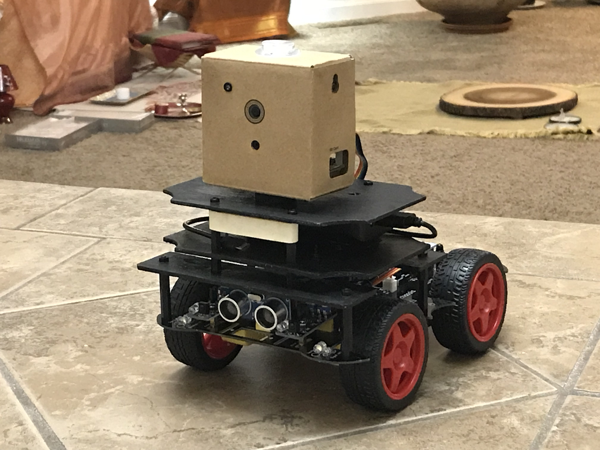

## Motivation
After playing with Google Vision AIY kit I decided to put it on wheels and turn a cheap remote-controlled Arduino toy car kit into autonomous mobile Edge AI device. The new robot uses face-recognition model pre-installed on Google Vision AIY kit to search and approach faces or their images. Full documentation and methodology are provided in this tutorial. 
This is the demo of the final product:

<a href="https://youtu.be/haavBON7rUw
" target="_blank"></a>

## Warning
Please use common sense and be careful when playing with this robot - it is searching for human faces and drives toward them so don't put your face too close to the robot and don't let little children play with it without supervision!

## Hardware
- [Google AIY Vision](https://www.target.com/p/google-vision-kit-aiy/-/A-53417081)
- [UNIROI Arduino Robot Car Kit (with Arduino UNO R3 included)](https://www.amazon.com/UNIROI-Ultrasonic-Infrared-Tracking-Required/dp/B07CVS1LBT)
- 3-Pin 15cm Servo Extension Cable Male-to-Male (3 units)
- [SparkFun Jumper Wire - 0.1", 6-pin, 12"](https://www.sparkfun.com/products/10376)
- [SparkFun Logic Level Converter - Bi-Directional](https://www.sparkfun.com/products/12009)
- Wires (generic) (5 units)
- ZILU Smart Power Basic 4400mAh Portable Charger or similar (to power Google Vision AIY kit)
- [Black Nylon Screw and standoff](https://www.digikey.com/product-detail/en/adafruit-industries-llc/3299/1528-2339-ND/)
- Plywood Sheets (as mount plates) (3 units) - I bought them at JoAnn Fabrics 
- [Camera Mounting Screw Adapter](https://www.alibaba.com/product-detail/Camera-Mounting-Screw-Camera-Flash-Adapter_60263239907.html)
- [Reusable Hook & Loop Strong Grip Fastener Roll 1" x 16](https://www.amazon.com/dp/B01K3JO3QO)
- [SparkFun Break Away Headers - Straight](https://www.sparkfun.com/products/116)
- [Double Sided PCB Board](https://www.amazon.com/dp/B075VSJCD2)
- [YI Action Camera (Optional)](https://www.amazon.com/YI-Action-Camera-US-White/dp/B016EIGEGU)

## Robot Chassis
I purchased **UNIROI Smart Robot Car Kit Arduino Robot Kit** on amazon.com which comes with **Arduino UNO R3** board and documentation including chassis schematics, assembly instructions and Arduino sketch *Comprehensive_Experiment.ino* uploaded to UNO R3 by a manufacturer (located in **/arduino** folder.)

| Chassis |
|---------|
| 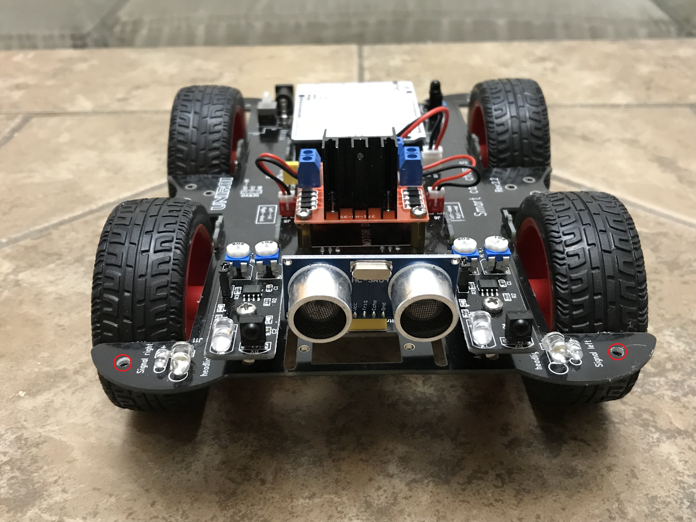|

## Adding Google Vision AIY kit

I drilled two holes in the front part of the chassis (marked with red circles on the image above) and used plastic standoffs and screws to attach **plywood sheets** from Joann Fabrics (colored in black) which I used as mount plates for **Google Vision AIY kit** and other components. 

The Google Vision AIY kit was attached to the upper deck with the **Camera Mounting Screw adapter**.

The lower deck was used to carry a power supply **ZILU Smart Power Basic 4400mAh Portable Charger** for Google Vision AIY kit (attached with Velcro tape the top) and the **SparkFun Logic Level Converter** (at the bottom.) Bi-Directional Logic Level Converter was used to connect pins of Google Vision AIY kit with Arduino pins (more on this in the section Connecting Google Vision AIY kit with Arduino below.)

Make sure that the charging port of the power supply is accessible so you could charge it without removing the upper deck. Also, when selecting the power supply for Google Vision AIY kit make sure it can provide at least 2.1 Amps as mentioned on Google Vision kit's website (otherwise AIY kit will keep crashing) and have a capacity sufficient to run the kit for at least 20-30 minutes (capacity greater than 3000mAh should be fine.)

| Upper deck with mount screw for Google kit | Lower deck with attached power bank |
|--------------------------------------------|-------------------------------------|
|  |  | 

| Lower deck with PCB (bottom view) with LLC) | Lower deck assembled |
|---------------------------------------------|----------------------| 
|  |  |

## Connecting Google Vision AIY kit with Arduino

The output of the face-detection model which runs on Vision Bonnet of Google Vision AIY kit should be sent from Google Vision kit to Arduino so the car could act on it. The question is how to connect these two devices. A natural way would be to use a Serial port of Arduino and Data port of Google Vision kit. Unfortunately, communication via Serial port substantially slows down the face-detector which runs on Google Vision. Because of this, I decided to design a communication protocol which uses 4 GPIO expansion pins (**PIN_A** to **PIN_D**) on the Vision Bonnet of Google Vision kit and 4 Arduino pins.

| GPIO expansion pins of Vision Bonnet | GPIO pins on the back of the kit |
|---------------------------------------------|----------------------| 
| 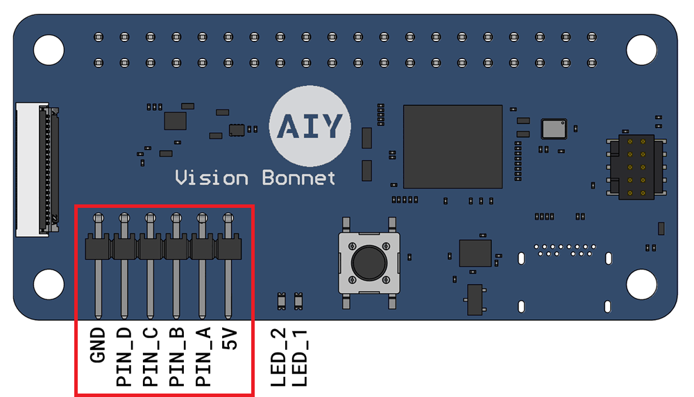 |  |

Analysis of chassis schematics and Arduino sketch uploaded to UNO R3 by a manufacturer (called *Comprehensive_Experiment.ino*) showed that all Arduino pins except for digital pin **#11** (**D11**) are used by car sensors, actuators, and other devices. As I need 4 pins for communication, I removed three components:
- Speaker (buzzer) connected to the digital pin **#12** (**D12**); and
- Two line-tracking sensors installed on the bottom of the car connected to analog pins **A2** and **A3** of Arduino UNO R3. 

I also removed (unplugged) a Bluetooth module as I did not plan to use it.

This gave me 4 pins (D11, D12, A2, and A3) for communication with 4 GPIO expansion pins (PIN_A, PIN_B, PIN_C, and PIN_D) of Vision Bonnet of Google Vision AIY kit.

## Logic Level Converter

Because Arduino is a 5 Volt device and Raspberry Pi of Google Vision AIY kit is a 3.3 Volt device and because we want to use 4 pins for communication, we would need a **4-channel Level Logic Converter (or LLC)**.

### Arduino side: 
I soldered three 3-Pin Breakaway Pin Headers to the car chassis (marked **UD4**, **UD3**, and **UD5** on the chassis and on the image below) and then used three 3-pin 15cm Servo Extension Male-to-Male cables to connect those pin male headers to Logic Level Converter (Arduino or **HIGH** side of the LLC.)

| Three 3-pin servo cables connecting Arduino pins with LLC |
|-----------------------------------------------------------------------------|
|  |

### Google Vision AIY kit side: 
I used 6-pin Jumper Wire to connect GPIO expansion pins of Vision Bonnet to Logic Level Converter (Google Vision kit or **LOW** LLC side.)

| 6-pin Jumper Wire connecting Google kit with LLC |
|-------------------------------------------------------------------------------------------|
|  |

**IMPORTANT:** To avoid damaging your boards make sure that you connect all cables correctly to both devices and to the Logic Level Converter!

The following schematic shows how Logic Level Converter is connected to Arduino (**H** or HIGH side of LLC) and Google Vision (**L** or LOW side of LLC.)

| Schematics of LCC connections | Soldered LCC with connections |
|---------------------------------------------|----------------------| 
|  |  |

Once you soldered Logic Level Converter and connectors to [PCB Board](https://www.amazon.com/dp/B075VSJCD2), attach the board with LLC to the bottom of the lower deck, attach the Google Vision AIY kit to the top of the upper deck and connect the wires from the board with LLC to Arduino/Chassis and Google Vision AIY kit.

Double check that you connected the wires correctly - make sure that

- 6-pin connector to Google Vision kit is not upside-down - if you look on the kit from behind then **GND** pin (which should be connected to the black wire) would the leftmost and **5V** pin (red wire) - the rightmost.
-  3-pin connectors to Arduino/Chassis are connected to the proper pins (**UD3**, **UD4**, **UD5**) on the chassis and are not upside down.

**Your robot is ready!** If you like you can use a rubber band to attach the (optional) **YI Action** or **Go Pro** camera to make FPV (First Person View) videos.

| Assembled robot (front view) | Assembled robot (left view) |
|---------------------------------------------|----------------------| 
|  | 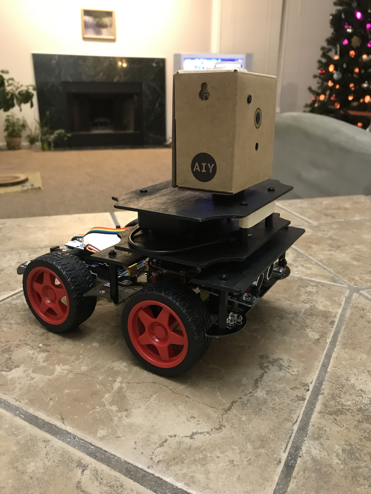 |

| Assembled robot (right view) | Assembled robot (rear view) |
|------------------------------|-----------------------------| 
|  | 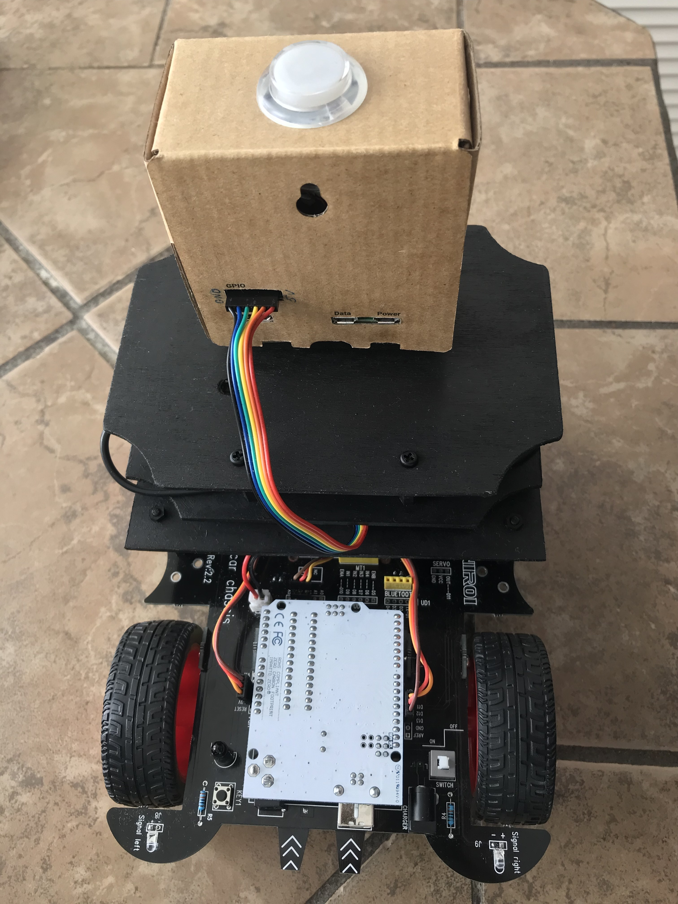 |

| Upper and lower decks | Robot with front camera |
|------------|------------| 
| 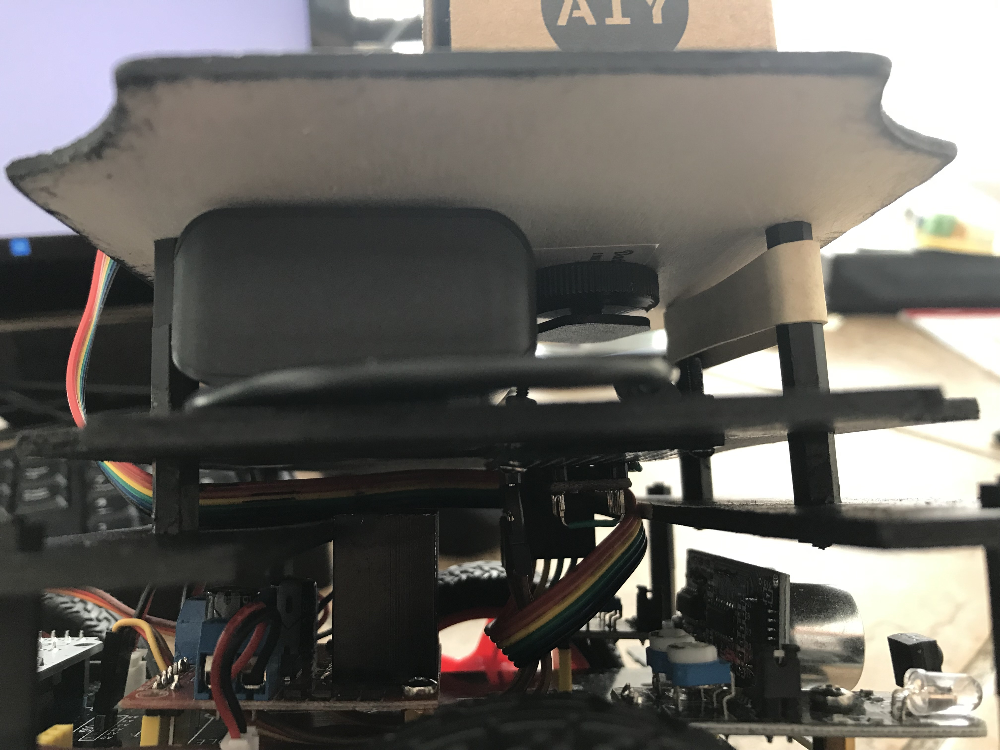 |  |

| Upper deck | Lower deck |
|------------|------------| 
| 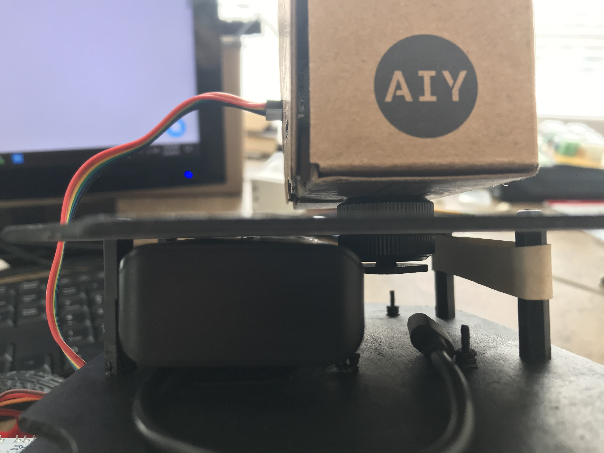 | 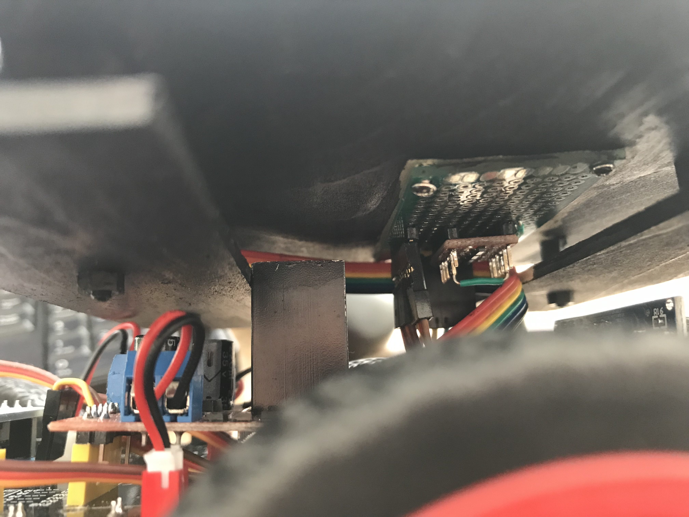 |

## Communication protocol 

I designed the following communication protocol via the pins of Arduino and GPIO expansion pins of AIY kit's Vision Bonnet.

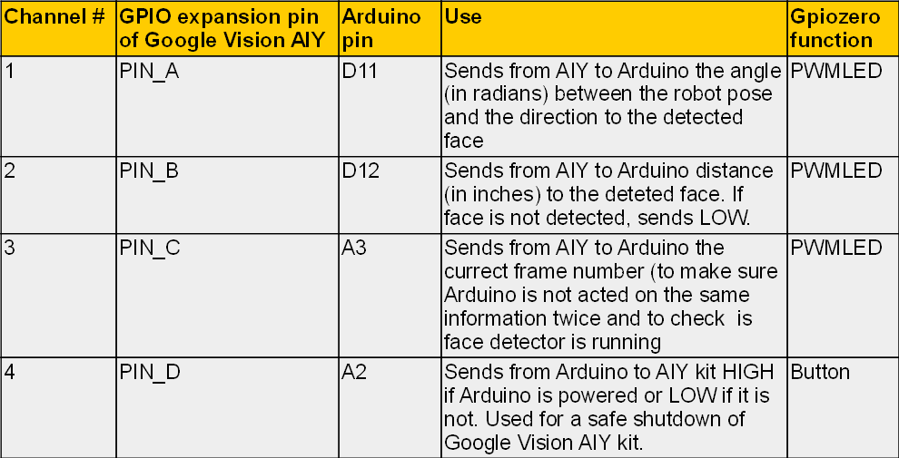

To send the analog values (like the direction or the distance to the detected human face) from Google Vision AIY kit to Arduino via the pins I used [Pulse Width Modulation](https://learn.sparkfun.com/tutorials/pulse-width-modulation/all) or PWM which is a technique for getting analog results with digital means. If a digital signal spends half of the time on (HIGH) and the other half off (LOW), we would say the digital signal has a **duty cycle** of 50% which resembles an ideal square wave. If the digital signal spends more time in the HIGH state than in the LOW state then the duty cycle will be greater than 50%. If the digital signal spends less time in the HIGH state than in the LOW state then the duty cycle will be less than 50%. The following graph illustrates these three scenarios:
 
| Duty cycles (Source: Sparkfun.com) |
|------------|
|  |

In order to send then the analog signal from Google AIY to Arduino the analog signal should be converted into a real number (a fraction) between 0 (LOW) to 1 (HIGH) and this number determines the value of the duty cycle - 50% duty cycle corresponds to the transmitted value of 0.5, 25% duty cycle - to 0.25 and so on.

On Google Vision AIY kit's side, it is implemented with gpiozero Python library's function [PWMLED](https://gpiozero.readthedocs.io/en/stable/api_output.html?highlight=PWMLED#pwmled)

On Arduino side, the best option to implement PWM is the library [PinChangeInterrupt](https://playground.arduino.cc/Main/PinChangeInterrupt) (make sure you install it) because it allows measuring the values of the duty cycle on any Arduino UNO pin, both digital and analog. It calculates the time in microseconds between the moment when the voltage on a particular pin changes from LOW to HIGH and the moment when it goes back from HIGH to LOW (named channel_length in the attached Arduino sketch My_robot_Arduino.ino) Once we know this number, we can calculate the value of duty cycle (which can vary from 0 to 1) as follows:

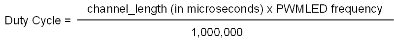

**Practical considerations:** I found that it is somewhat difficult to accurately detect the voltage changes from LOW to HIGH and back (or from HIGH to LOW and back) when the time interval between these two events is very short - the former case corresponds to the very low (close to 0) values of the duty cycles, the latter - to the very high (close to 1) values. Because of that, I chose 0.1 and 0.9 for the lower and upper bounds of duty cycles. In other words, all the values calculated by Google Vision AIY should be mapped into the [0.1, 0.9] range before they are sent to Arduino.

## Coding and decoding values sent from Google AIY to Arduino

As mentioned all values from Google Vision AIY should be mapped (coded) to [0.1, 0.9] range before they are sent to Arduino via pins with PWM. Once they are received by Arduino, the values should be decoded so Arduino would know the true value which was calculated and sent by Google Vision AIY. 

The following describes the coding/decoding process I used.

### Coding
- Determine min_value  and max_value - min and max values of the relevant variable calculated by AIY kit which you want to send to Arduino. For example, the smallest and largest angle (between the direction the robot faces and the direction to the detected human face) is determined by the parameters of the camera - focal length and horizontal camera resolution (both in pixels):

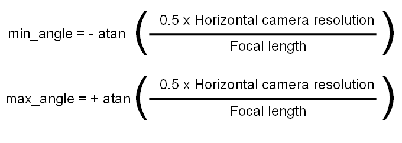

- Once you determined min_value  and max_value, make sure that the values Google AIY calculates are clamped - values lower than min_value and higher than max_value are assigned min_value  and max_value correspondingly.
- Once you receive the calculated value (angle in this example) from Google AIY (and clamp it to [min_value, max_value] range if necessary), apply the following formula to calculate the value of angle which should be sent from Google Vision AIY to Arduino (i.e. coded value):

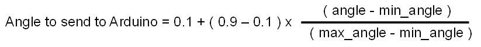

You can check that when **angle = min_angle** (which corresponds to the case when a face is detected in the leftmost part of the image), Arduino will receive the value of 0.1; when **angle = max_angle** (face detected in the rightmost part of the image) Arduino will receive the value of 0.9

The coding should of course be performed on Google AIY side (i.e. in Python script **my_robot.py** which runs on AIY.)    

### Decoding

Once Arduino receives the coded value (Angle to send to Arduino), Arduino should decode it back to the original value (angle) by using formula very similar to the one above:

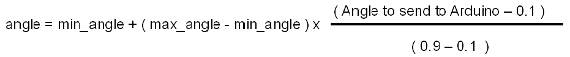

This decoding should be performed by Arduino (in Arduino sketch **my_robot_Arduino.ino**) but, of course, to ensure the correct decoding the values of min_angle and max_value should be the same in Python script ran on Google AIY and in the sketch ran on Arduino.

The section above explains in details the entire communication on the Channel # 1 (**PIN_A** of Google AIY to pin **D11** of Arduino) which is used to send the angle between the direction which robot faces and the direction to the detected human face from Google AIY to Arduino.

Channel # 2 (**PIN_B** of Google AIY to pin **D12** of Arduino) and Channel # 3 (**PIN_D** of Google AIY to pin **A3** of Arduino) uses a very similar coding/decoding logic. The only difference is that for the Channel # 2 the lower bound for the coded value is 0.2 (not 0.1) The reason for that is because Channel # 2 is used for two purposes - to send the approximate distance to the detected face in inches if the face is detected (values between 0.2 and 0.9) OR to let Arduino know that no face is detected (in the latter case value of 0.1 is sent.) 

For Channel # 3 it is not critical to decode the values exactly - its main goal is to monitor a "health" of the face detector running on Google Vision AIY kit and to make sure that Arduino does not act on the same information (i.e. on the data from the same frame) twice. Because of this unlike Channels #1 and #2 it is not important what the actual values received by Arduino via Channel #3 are. The only thing which is important is that two successive values received by Arduino should be *different*.

Channel # 4 (**PIN_D** of Google AIY to pin **A2** of Arduino) is not used for sending values via PWM - actually it communicated in the opposite direction. It simply sends HIGH value from Arduino to Google AIY when Arduino is powered and LOW when Arduino's power is off. It is used for a safe shutdown of Google Vision AIY kit. 

## Installation: Google Vision AIY kit side

I used Version 1.1 of Google Vision kit from Target with flashed **2018-11-16** [image](https://aiyprojects.withgoogle.com/vision/#more-info--system-updates). 

After you power up the kit, create the folder 
 ```
 /home/pi/AIY-projects-python/src/examples/robot 
 ```

Place the Python script **my_robot.py** into this new folder and set file's **Properties** so it can be executed by *Anyone*. I had some issues with RPi.GPIO (Error message *GPIO pin is already in use*) but when I run script with **sudo** I don't have this problem so navigate to the new folder and start the script:

```
cd /src/examples/robot
sudo ./my_robot.py
```

Once the LED on the top of the Google Vision kit start blinking (with BLUE) the face detector is running. I found it very useful to show the detector the image of human face from the magazine. When the face is detected the LED on the top of the kit will be GREEN.
Once you are comfortable with the script and it works you can create a service which would run this script at bootup which is very useful for real time applications like this. Google explains well on the [Google Vision's home page](https://aiyprojects.withgoogle.com/vision/#makers-guide--run-your-app-at-bootup) how to create and enable the service. However, I had some problems with permissions and could not make symlink work. So I created the service file **my_robot.service** (attached), placed it in
 ```
/home/pi/AIY-projects-python/src/examples/robot
 ```
 and then sudo-copied it to
 
 ```
~/Programs/my_program.service /lib/systemd/system
 ```
 
```
# copy my_robot.service to system folder
sudo cp ~/AIY-projects-python/src/examples/robot/my_robot.service /lib/systemd/system/my_robot.service

# Reload the service files so the system knows about this new one
sudo systemctl daemon-reload

# Enable my_robot service to run on bootup
sudo systemctl enable my_program.service
```

After this try to reboot the kit - the service should run at bootup. 

## Installation: Arduino side
Upload sketch **my_robot_Arduino.ino** to Arduino UNO R3. Basically this sketch replaces Bluetooth functionality with autonomous feature to search for and approach detected human faces or their images. I did not change the other parts of the original code which comes with the toy - the functions for the autonomous mode which I added are 
- **search_and_approach** - main pipeline which processes data from Google Vision AIY kit and drives the autonomous robot; and
- **print_robot_state** - optional function useful for debugging which, if called, sends robot state and the data coming from the Google Vision AIY kit to Arduino Serial monitor.

Make sure you install Arduino libraries **PinChangeInterrupt** and **IRremote**.

## Powering up the devices

It is not critical in which order to power up Google Vision AIY kit and Arduino/Chassis. I usually start Google AIY first and once LED blinks BLUE I power up the Chassis.

A default mode after powering up the car is control via infrared remote which comes with the kit. To change it to autonomous face-chasing mode push the **KEY1** button (located next to Arduino and rear left wheel of the robot - you can see it on the video or on the image below.)

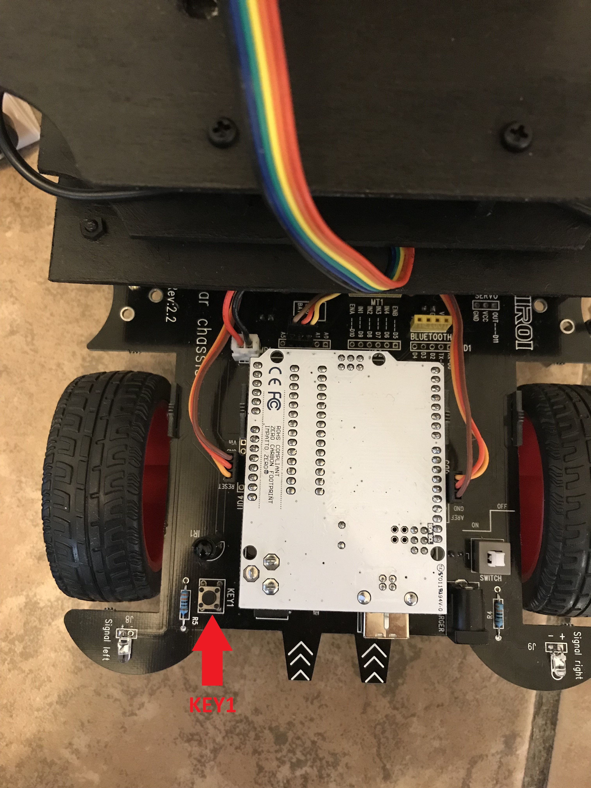

Once autonomous mode is activated, robot will rotate looking for the faces around. Once it detects the face, it will correct its pose and start driving toward the face. If it loses the face, robot will scan the environment in the direction where the face was detected last time. To help the robot with detection make sure you have enough light in the room, especially if the faces are far away from the robot. If the robot detects multiple faces it will select the largest one. However, if there are many people in the room and robot will detect multiples faces of about the same size, the robot may got confused. Note that you can always change the mode back to the one with infrared remote control (non-autonomous) by pushing **KEY1** button again.

## Safe shutdown of Google Vision AIY kit

To power down the devices simply turn of  the white power switch on robot chassis. Once Arduino/Chassis don't have power, Google Vision kit would wait for 10 frames (about 5-7 seconds) and then LED on the top of the Google Vision AIY kit with blink 10 times with RED and Google AIY kit will go into safe shutdown mode. If you powered down Chassis by accident, you have those 5-7 second to power Chassis up again before Google Vision kit starts shut down process.

## Conclusion

I really enjoyed dong this project and would appreciate your feedback. There are many interesting project based on this platform - one can design a better (PID) controller to drive the robot toward the goal, one can fuse information from Google Vision AIY kit camera with the data from the installed on the car ultra-sound and infrared sensors; one can try different model to avoid obstacles. If you decide to do this project please keep me posted on your progress.

## Bonus video

<a href="https://youtu.be/992VRxzRjws
" target="_blank"></a>

## Thank you!
