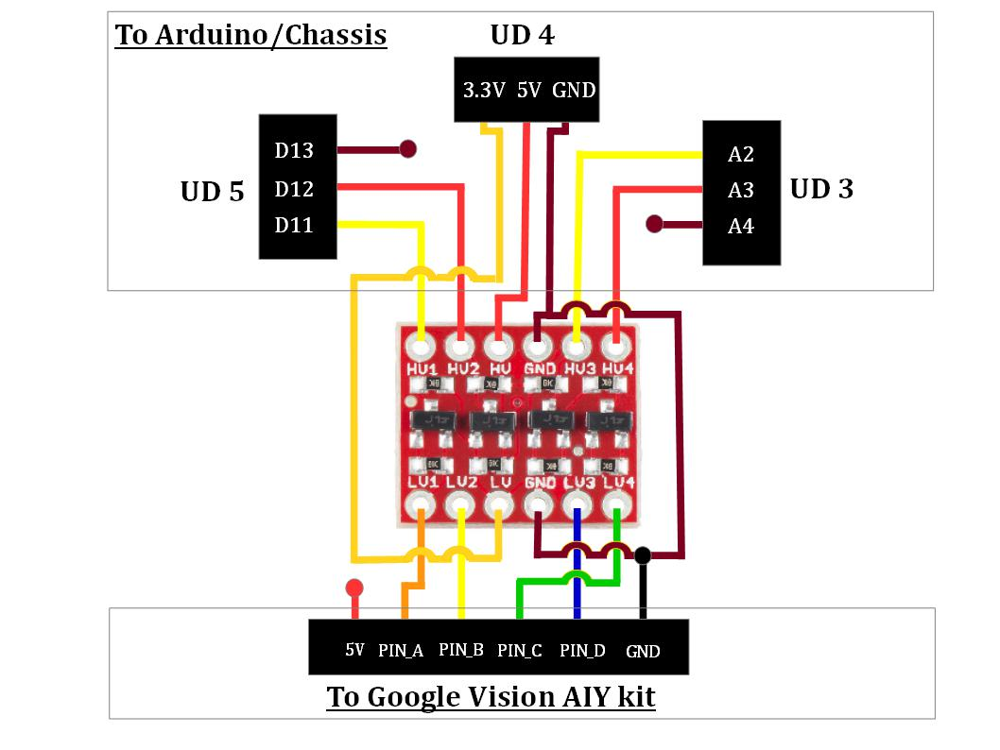

# Google-Vision-AIY-on-Wheels

## Motivation
After playing with Google Vision AIY kit I decided to put it on wheels and turn a cheap remote-controlled Arduino toy car kit into autonomous mobile Edge AI device. The new robot uses face-recognition model pre-installed on Google Vision AIY kit to search and approach faces or their images. Full documentation and methodology are provided in this tutorial. 
This is the demo of the final product:

## Warning
Please use common sense and be careful when playing with this robot - it is searching for human faces and drives toward them so don't put your face too close to the robot and don't let little children play with it without supervision!

## Hardware
- [Google AIY Vision](https://www.target.com/p/google-vision-kit-aiy/-/A-53417081)
- [UNIROI Arduino Robot Car Kit (with Arduino UNO R3 included)](https://www.amazon.com/UNIROI-Ultrasonic-Infrared-Tracking-Required/dp/B07CVS1LBT)
- 3-Pin 15cm Servo Extension Cable Male-to-Male (3 units)
- [SparkFun Jumper Wire - 0.1", 6-pin, 12"](https://www.sparkfun.com/products/10376)
- [SparkFun Logic Level Converter - Bi-Directional](https://www.sparkfun.com/products/12009)
- Wires (generic) (5 units)
- ZILU Smart Power Basic 4400mAh Portable Charger or similar (to power Google Vision AIY kit)
- [Black Nylon Screw and standoff](https://www.digikey.com/product-detail/en/adafruit-industries-llc/3299/1528-2339-ND/)
- Plywood Sheets (as mount plates) (3 units) - I bought them at JoAnn Fabrics 
- [Camera Mounting Screw Adapter](https://www.alibaba.com/product-detail/Camera-Mounting-Screw-Camera-Flash-Adapter_60263239907.html)
- [Reusable Hook & Loop Strong Grip Fastener Roll 1" x 16](https://www.amazon.com/dp/B01K3JO3QO)
- [SparkFun Break Away Headers - Straight](https://www.sparkfun.com/products/116)
- [Double Sided PCB Board](https://www.amazon.com/dp/B075VSJCD2)
- [YI Action Camera (Optional)](https://www.amazon.com/YI-Action-Camera-US-White/dp/B016EIGEGU)

## Robot Chassis
I purchased **UNIROI Smart Robot Car Kit Arduino Robot Kit** on amazon.com which comes with **Arduino UNO R3** board and documentation including chassis schematics, assembly instructions and Arduino sketch *Comprehensive_Experiment.ino* uploaded to UNO R3 by a manufacturers (located in **/arduino** folder.)

| Chassis |
|---------|
| |

## Adding Google Vision AIY kit

I drilled two holes in the front part of the chassis (marked with red circles on the image above) and used plastic standoffs and screws to attach **plywood sheets** from Joann Fabrics (colored in black) which I used as mount plates for **Google Vision AIY kit** and other components. 

The Google Vision AIY kit was attached to the upper deck with the **Camera Mounting Screw adapter**.

Lower deck was used to carry a power supply **ZILU Smart Power Basic 4400mAh Portable Charger** for Google Vision AIY kit (attached with Velcro tape the top) and the **SparkFun Logic Level Converter** (at the bottom.) Bi-Directional Logic Level Converter was used to connect pins of Google Vision AIY kit with Arduino pins (more on this in the section Connecting Google Vision AIY kit with Arduino below.)

Make sure that the charging port of the power supply is accessible so you could charge it without removing the upper deck. Also, when selecting the power supply for Google Vision AIY kit make sure it can provide at least 2.1 Amps as mentioned on Google Vision kit's website and have a capacity sufficient to run the kit for at least 20-30 minutes (capacity greater than 3000mAh should be fine.)

| Upper deck with mount screw for Google kit | Lower deck with attached power bank |
|--------------------------------------------|-------------------------------------|
|  |  | 

| Lower deck with PCB (bottom view) with LLC) | Lower deck assembled |
|---------------------------------------------|----------------------| 
|  |  |

## Connecting Google Vision AIY kit with Arduino

The output of face-detection model which runs on Vision Bonnet of Google Vision AIY kit should be sent from Google Vision kit to Arduino so the car could act on it. The question is how to connect these two devices. A natural way would be to use a Serial port of Arduino and Data port of Google Vision kit. Unfortunately, communication via Serial port substantially slows down the face-detector which runs on Google Vision. Because of this I decided to design a communication protocol which uses 4 GPIO expansion pins (**PIN_A** to **PIN_D**) on the Vision Bonnet of Google Vision kit and 4 Arduino pins.

| GPIO expansion pins of Vision Bonnet | GPIO expansion pins on the back of the kit |
|---------------------------------------------|----------------------| 
|  |  |

Analysis of chassis schematics and Arduino sketch uploaded to UNO R3 by a manufacturer (called *Comprehensive_Experiment.ino*) showed that all Arduino pins except for digital pin **#11** (**D11**) are used by car sensors, actuators and other devices. As I need 4 pins for communication, I removed three components:
- Speaker (buzzer) connected to the digital pin **#12** (**D12**); and
- Two line tracking sensors installed on the bottom of the car which were connected to analog pins **A2** and **A3** of Arduino UNO R3. 

I also removed (unplugged) a Bluetooth module as I did not plan to use it.

This gave me 4 pins (D11, D12, A2 and A3) for communication with 4 GPIO expansion pins (PIN_A, PIN_B, PIN_C and PIN_D) of Vision Bonnet of Google Vision AIY kit.

## Logic Level Converter

Because Arduino is a 5 Volt device and Raspberry Pi of Google Vision AIY kit is a 3.3 Volt device and because we want to use 4 pins for communication, we would need a **4-channel Level Logic Converter (or LLC)**.

### Arduino side: 
I soldered three 3-Pin Breakaway Pin Headers to the car chassis (marked **UD4**, **UD3** and **UD5** on the chassis and on the image below) and then used three 3-pin 15cm Servo Extension Male-to-Male cables to connect those pin male headers to Logic Level Converter (Arduino or **HIGH** side of the LLC.)

| Three 3-pin servo cables connecting Arduino pins with LLC |
|-----------------------------------------------------------------------------|
|  |

### Google Vision AIY kit side: 
I used 6-pin Jumper Wire to connect GPIO expansion pins of Vision Bonnet to Logic Level Converter (Google Vision kit or **LOW** LLC side.)

| 6-pin Jumper Wire connecting Google kit with LLC |
|-------------------------------------------------------------------------------------------|
|  |

**IMPORTANT:** To avoid damaging your boards make sure that you connect all cables correctly to both devices and to the Logic Level Converter!

The following schematics shows how Logic Level Converter is connected to Arduino (**H** or HIGH side of LLC) and Google Vision (**L** or LOW side of LLC.)

| Schematics of LCC connections | Soldered LCC with connections |
|---------------------------------------------|----------------------| 
|  |  |

Once you soldered Logic Level Converter and connectors to [PCB Board](https://www.amazon.com/dp/B075VSJCD2), attach the board with LLC to the bottom of the lower deck, attach the Google Vision AIY kit to the top of the upper deck and connect the wires from the board with LLC to Arduino/Chassis and Google Vision AIY kit.

Double check that you connected the wires correctly - make sure that

- 6-pin connector to Google Vision kit is not upside-down - if you look on the kit from behind then **GND** pin (which should be connected to the black wire) would the leftmost and **5V** pin (red wire) - the rightmost.
-  3-pin connectors to Arduino/Chassis are connected to the proper pins (**UD3**, **UD4**, **UD5**) on the chassis and are not upside down.

**Your robot is ready!** If you like you can use a rubber band to attach the (optional) **YI Action** or **Go Pro** camera to make FPV (First Person View) videos.

| Assembled robot (front view) | Assembled robot (left view) |
|---------------------------------------------|----------------------| 
|  |  |

| Assembled robot (right view) | Assembled robot (rear view) |
|---------------------------------------------|----------------------| 
|  |  |

